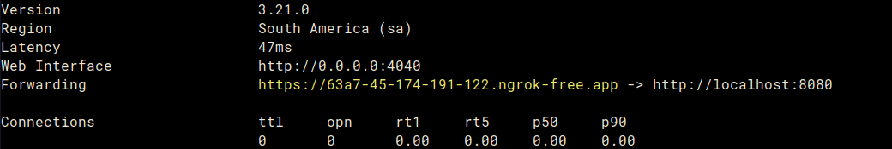
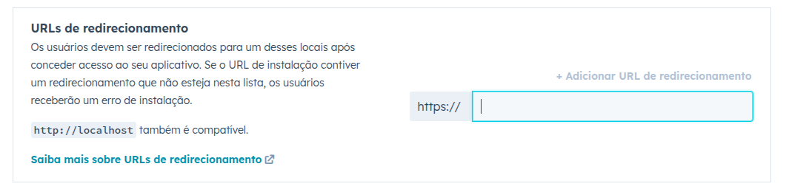
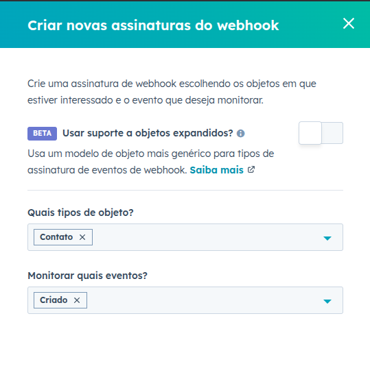
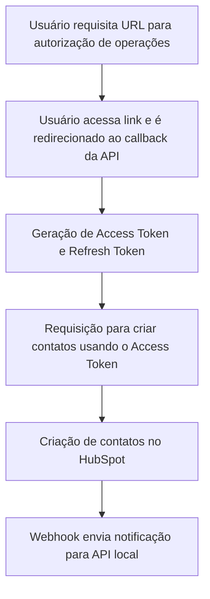

## Case Técnico – Integração com HubSpot (Meetime)

Este projeto foi desenvolvido como parte do teste técnico da Meetime, com foco em realizar operações de integração entre uma API local e o CRM da HubSpot.


[Documentação sobre uso das tecnologias](./WHY.md)

---

## 🔧 Tecnologias Utilizadas

- Java 17
- Spring Boot
- Docker
- Ngrok
- HubSpot Developer API

---

## ⚙️ Requisitos

Antes de executar o projeto, certifique-se de ter os seguintes itens instalados/configurados:

- Porta `8080` liberada
- Conta de desenvolvedor no [HubSpot](https://br.hubspot.com/)
- Conta gratuita no [Ngrok](https://ngrok.com/). (Para fazer o túnel da API)
- Docker instalado ([instalar aqui](https://docs.docker.com/desktop/))

> ℹ️ Algumas informações adicionais foram fornecidas por e-mail, especialmente para facilitar a obtenção do token Ngrok sem necessidade de criação definitiva de conta.

---

## 🚀 Executando o Projeto

### 1. Expondo a API Local com Ngrok

Autentique-se no [dashboard do Ngrok](https://dashboard.ngrok.com/get-started/your-authtoken) e copie o seu **Authtoken**.

Em seguida, execute:

```bash
docker run --net=host -it -e NGROK_AUTHTOKEN=<TOKEN> ngrok/ngrok:latest http 8080
```

Exemplo de URL gerada (destacada em amarelo)


> O terminal exibirá uma URL pública (ex: `https://xyz123.ngrok-free.app`) que será utilizada para expor sua API local à internet.

---

### 2. Criando um App no HubSpot

Acesse sua conta de desenvolvedor e crie um novo aplicativo:

1. Vá até **Aplicativos** → **Criar novo aplicativo**
2. Defina nome e descrição
3. Em **Autenticação**:
    - No campo **URLs de redirecionamento**, adicione: `https://<NGROK_URL>/auth/callback`
      
    - Em **Escopos**, adicione o seguintes escopos como **obrigatórios**:
        - `crm.objects.contacts.read`
        - `crm.objects.contacts.write`
4. Salve o aplicativo

#### Configurando Webhook:

1. Acesse a aba **Recursos → Webhooks**
2. Defina a URL de destino como:
   `https://<NGROK_URL>/webhook/contacts`
3. Crie uma assinatura com:
    - Tipo de objeto: `Contato`
    - Evento: `Criado`
    - 
4. Ative o evento após criação

---

### 3. Configurando o `docker-compose.yml`

Acesse as credenciais do app criado no HubSpot (em **Autenticação**) e substitua as variáveis de ambiente no arquivo [`docker-compose.yml`](./docker-compose.yml):

```env
HUBSPOT_CLIENT_ID=xxx
HUBSPOT_CLIENT_SECRET=xxx
REDIRECT_URL=https://<NGROK_URL>
```

> ⚠️ Importante: **não adicione `/` ao final da URL de redirecionamento**.

---

### 4. Executando a API

Após configurar o arquivo `docker-compose.yml`, inicie o container com:

```bash
docker-compose up --build
```

A partir daqui poderá ser feito chamadas HTTP para os endpoints em `https://<NGROK_URL>` e responder na API que estará rodando localmente:

---

## 📑 Documentação do Fluxo da Integração

Abaixo está o fluxo básico de integração entre usuário, API e HubSpot:



Para a documentação das rotas dentro do projeto, visite [http://localhost:8080/swagger-ui.html](http://localhost:8080/swagger-ui.html) para ver a documentação feita pelo Swagger usando OpenAPI. 

---

### Criando novo contato

Após acessar a url de autorização gerada no `https://<NGOK_URL>/auth/url` e receber o access token da aplicação, você poderá ler  

```shell
curl --request POST \
  --url https://<NGROK_URL>/contacts \
  --header 'Authorization: Bearer <ACCESS_TOKEN>' \
  --header 'Content-Type: application/json' \
  --data '{
		"email": "alexsousa1435@gmail.com",
		"lastname": "Sousa",
		"firstname": "Alex"
  }'
```


---

## 📬 Contato

Caso tenha dúvidas ou sugestões, fique à vontade para entrar em contato.  
Este projeto foi construído para demonstrar domínio técnico em integrações com APIs externas, autenticação OAuth2, e uso de webhooks.